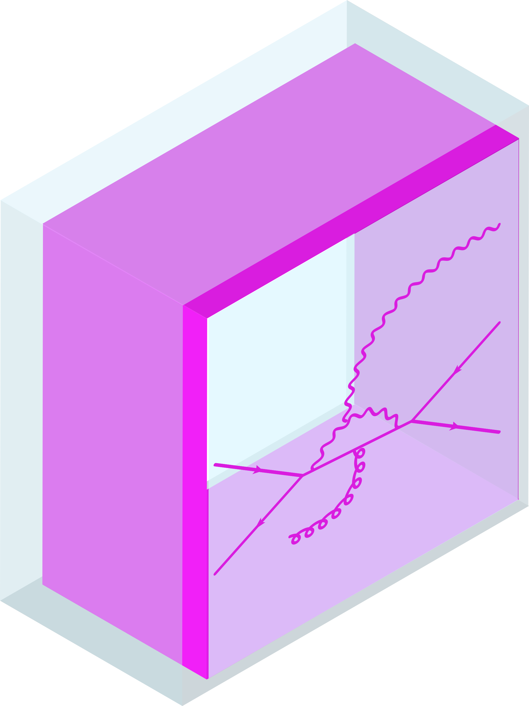

 

  

  <h3 align="center">PyInkFeyn</h3>
  

**PyInkFeyn** is a powerful Inkscape extension designed to create professional, publication-ready Feynman diagrams. Unlike standard drawing tools, PyInkFeyn understands the physics behind the lines, offering automated propagators, LaTeX support, and intelligent flow direction.

## 🚀 Features

* **Smart Propagators**: Automatic styling for Fermions, Photons, Gluons, and Scalars.
* **Intelligent Flow Direction**: Force arrows to point **Up, Down, Left, or Right** regardless of how you drew the path.
* **Momentum Support**: Add momentum arrows that flow independently of the particle flow.
* **LaTeX Integration**: Automatically renders labels in math mode for perfect scientific typography.
* **Non-Destructive Editing**: Uses "ghost paths" to display arrows, keeping your original paths easy to edit with Inkscape’s Node tool.

## 📥 Installation

1. **Download**: Go to the [Releases](https://github.com/paulhenry46/PyInkFeyn/releases) page and download the latest `pyinkfeyn_vX.X.X.zip`.
2. **Extract**: Unzip the contents.
3. **Install**: Copy the files (`.inx` and `.py` files, and the `pyfeyngen` folder) into your Inkscape extensions folder:
* **Linux**: `~/.config/inkscape/extensions/`
* **Windows**: `%APPDATA%\inkscape\extensions\`
* **macOS**: `~/Library/Application Support/org.inkscape.Inkscape/config/inkscape/extensions/`
4. **Restart**: Restart Inkscape.

## 🛠 Usage
Go to `extensions > Physics > PyInkFeyn Stylize / PyInkFeyn Generator`

PyInkFeyn offers two ways to work:

### 1. Draw Mode (Automatic Generation)

Input a simple text-based description of your diagram (e.g., `e- e+ > gamma > mu- mu+`) to generate a complete diagram instantly. For more details about syntax, see [repo of pyfeyngen](https://github.com/paulhenry46/pyfeyngen) or [demo site](https://pyfeyngen.saux.fr/).

### 2. Stylize Mode (Selection)

1. Draw a path (straight or curved) using the **Bézier Tool (B)**.
2. Select the path.
3. Go to **Extensions > PyInkFeyn > PyInkFeyn Stylize**.
4. Choose your particle type and **Arrow Orientation** (e.g., "Right" to ensure the arrow points toward the future).

## 🧬 Dependencies

This extension bundles a specific version of the `pyfeyngen` library. You do **not** need to install it separately if you use the provided release ZIP.

## 🤝 Contributing

For developpers, you can simply clone the repo and populate the `pyfeyngen` folder with all files from `src/pyfeyngen` of the [repo of pyfeyngen](https://github.com/paulhenry46/pyfeyngen).

Contributions are welcome! If you find a bug or have a feature request, please open an **Issue** or a **Pull Request**.

## 📄 License

This project is licensed under the MIT License - see the LICENSE file for details.

## Troubleshooting

### I want to style a path for a second time but noting happen when I click on Apply !
You have selected a ghost path, which you can't see. It is used by the extension to draw central arrow on path with live path effect. Check which path you have selected with layer menu.

## Special thanks
Special thanks to @pmc4 for [this repo](https://github.com/pmc4/feynkscape?tab=readme-ov-file#usage) which helps me drawing some effects. 
